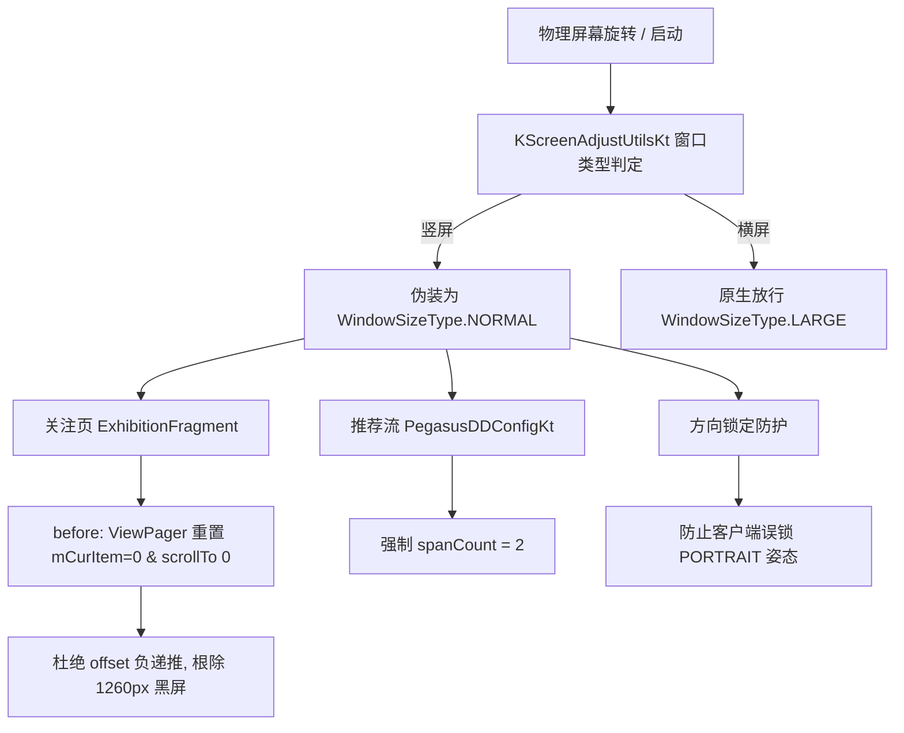

# 哔哩响应优化 (BiliResponsive)

[](LICENSE)
[](https://github.com/benbaobaoshigemi/BiliResponsive/releases)
[-fb7299)](https://www.bilibili.com)
[]()

专为安卓平板与折叠屏设备量身打造的哔哩哔哩（`tv.danmaku.bili`）LSPosed 响应式体验重构模块。

解决中小尺寸平板（如 8.8 英寸 OPPO Pad Mini、拯救者 Y700 等）在**竖屏手持使用时，B站强行套用平板大屏排版导致的动态双栏割裂、首页卡片拥挤拥塞与旋转黑屏错位**等顽疾。

---

## 📸 核心特性与效果展示

### 1. 竖屏手机原生体验，横屏平板宽屏大视野
- **关注 / 动态页响应式切换**：
  - **竖屏（Portrait）**：强制采用手机原生单栏布局，恢复顶部横向滑动 UP 主头像条与沉浸式卡片流；彻底终结平板模式下违和的双栏中介容器（`WideMediatorFragment`）与左侧纵向死板巨型 UP 栏；
  - **横屏（Landscape）**：保留大屏双栏排版，左侧 UP 导航栏紧凑贴边靠左对齐（$x=145$），右侧卡片满屏自适应。
- **首页推荐流动态 Span 适配**：
  - **竖屏（Portrait）**：由臃肿拥挤的 3 列卡片重塑为舒适大图双列（2 列）；
  - **横屏（Landscape）**：放行原生宽屏 4 列瀑布流。

### 2. 彻底根治横竖屏旋转 1260px 黑屏死区
- 针对从竖屏切横屏时，关注页 `ViewPager` 产生负数 offset 导致屏幕左侧产生半屏（1260px）黑屏、内容向右整体错位的底层数学缺陷，通过生命周期前置切断污染，实现多循环任意物理旋转无缝过渡。

### 3. 自由旋转保护
- 客户端在手机单栏排版下会尝试调用 `correctOrientation` 将 Activity 强行锁定为竖屏（`SCREEN_ORIENTATION_PORTRAIT`）。本模块将其重写为 `SCREEN_ORIENTATION_UNSPECIFIED`，支持平板 360° 自由旋转。

### 4. MIUIX / HyperOS 质感控制中心
- 基于 Jetpack Compose 构建极简 MIUIX 风格设置界面：大圆角沉浸卡片、平滑阻尼弹簧胶囊开关。
- 动态广播与系统设置双路实时热同步，配置修改即时生效。
- 提供安全的一键重启客户端按钮。

---

## 🛠 架构原理



- **底层窗口断点劫持**：挂钩 `kntr.common.screen.adjust.KScreenAdjustUtilsKt` 中的 `isLargePortrait`、`isLarge`、`isMedium`、`isNormal`、`widthBreakPoint*` 等全局断点方法。
- **容器与适配器解耦**：拦截 `ExhibitionFragment.bg()` 返回 `false`，禁用 `WideMediatorFragment` 双栏中介逻辑。
- **数学递推重置**：拦截 `ExhibitionFragment` 的 `onConfigurationChanged`、`Yf` 与 `fg`，在适配器数据集发生变化前前置重置 ViewPager 状态。

---

## 📦 作用域

- 目标应用：`tv.danmaku.bili`（哔哩哔哩）
- 目标进程：`tv.danmaku.bili`

---

## 🚀 安装与构建

### 预编译安装
从 [Releases](https://github.com/benbaobaoshigemi/BiliResponsive/releases) 页面下载最新的 `io.github.benbaobaoshigemi.biliresponsive-vX.X.X.apk`，在 LSPosed 管理器中启用模块并勾选哔哩哔哩作用域，重启哔哩哔哩即可。

### 本地编译
```bash
git clone https://github.com/benbaobaoshigemi/BiliResponsive.git
cd BiliResponsive
./gradlew assembleRelease
```

---

## 📄 开源协议

本项目基于 [Apache License 2.0](LICENSE) 协议开源。
